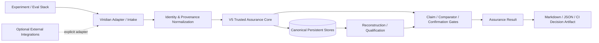

# Viridian Data Flow & Trust Boundaries

**Status:** Architecture-level public overview  
**Important:** A customer-specific deployment must produce its own exact data-flow diagram and network-behavior report.

## 1. Core flow

## 2. What enters Viridian

Depending on the case, inputs may include:

- run IDs;
- model/checkpoint identity;
- baseline/candidate identity;
- dataset/benchmark identity;
- evaluator/rubric identity;
- code/harness identity;
- environment identity;
- per-case outcomes;
- failures/timeouts/missing results;
- traces/log references;
- repeated-run evidence;
- confirmation state;
- declared requested claim.

Viridian should not require unrelated data merely because it is available.

## 3. Adapter / intake boundary

The adapter is responsible for translating an external system's artifacts into a structured Viridian evidence input.

The adapter must preserve:

- source identity;
- missingness;
- case/run identity;
- relevant configuration;
- evidence references.

An adapter may not silently promote external telemetry/log data into a stronger evidence class.

## 4. Trusted assurance core

The core applies the configured evidence and authority rules.

Representative responsibilities include:

- evidence classification;
- identity/provenance checks;
- comparator qualification;
- protected-regression checks;
- confirmation boundaries;
- taint/UNKNOWN handling;
- claim-scope determination;
- decision provenance.

## 5. Canonical persistent state

The current architecture uses local SQLite stores for structured evidence/provenance/reconstruction/recovery/qualification state.

Canonical state should remain distinguishable from:

- caches;
- UI views;
- summaries;
- search indexes;
- exported reports.

Derived state should be reconstructable from canonical evidence where the architecture defines it that way.

## 6. Assurance output

The output may include:

- PASS / FAIL / UNKNOWN;
- requested claim;
- findings;
- affected evidence;
- surviving evidence;
- strongest admissible statement;
- missing evidence;
- remediation / next experiment;
- exact scope/limitations;
- evidence references.

A CI status should link to or preserve this richer output rather than replacing it.

## 7. Optional external integrations

Potential future/adapter surfaces include:

- MLflow;
- OpenTelemetry / OTLP;
- OpenLineage;
- GitHub Actions;
- Hugging Face identities;
- evaluator frameworks;
- remote model providers.

These are **integration surfaces**, not automatic qualification.

Each must document:

- data sent/received;
- credentials;
- network destinations;
- version identity;
- missingness/failure semantics;
- whether data is persisted.

## 8. Network boundary

Core/local architecture should not be described as "no network" until the packaged release is measured.

See [Network Behavior Verification Plan](network-behavior-test-plan.md).

Optional remote integrations necessarily create network paths and must be represented explicitly.

## 9. Data minimization

For bounded reviews, prefer:

- metadata/identities over entire datasets where sufficient;
- redacted/sanitized artifacts;
- public fixtures;
- local references to large evidence rather than unnecessary copying;
- explicit retention rules.

## 10. Customer-specific overlay

Before a paid pilot, produce an overlay identifying:

- exact package/version;
- customer environment;
- adapter(s);
- canonical-store location;
- backup path;
- secrets source;
- egress rules;
- data retention;
- users/roles;
- exported artifacts.

That overlay—not this generic diagram—is the authoritative answer to "where does our data go?"
